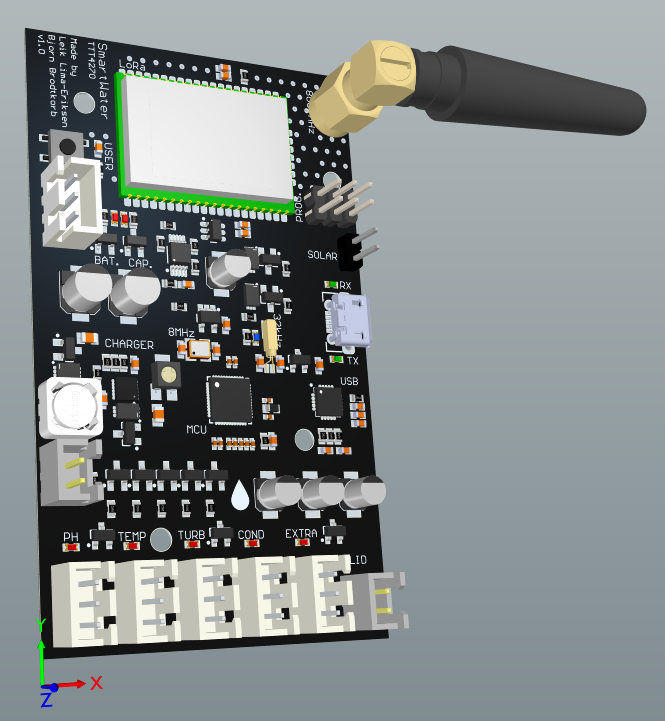
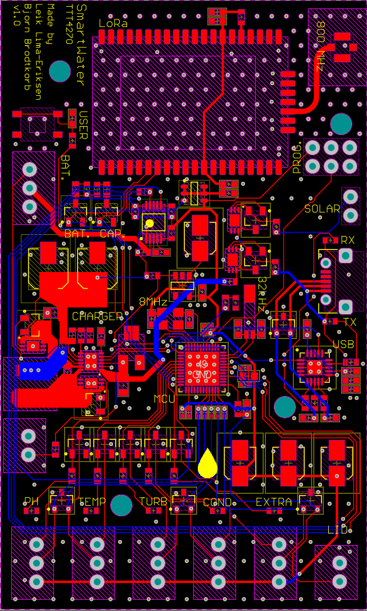
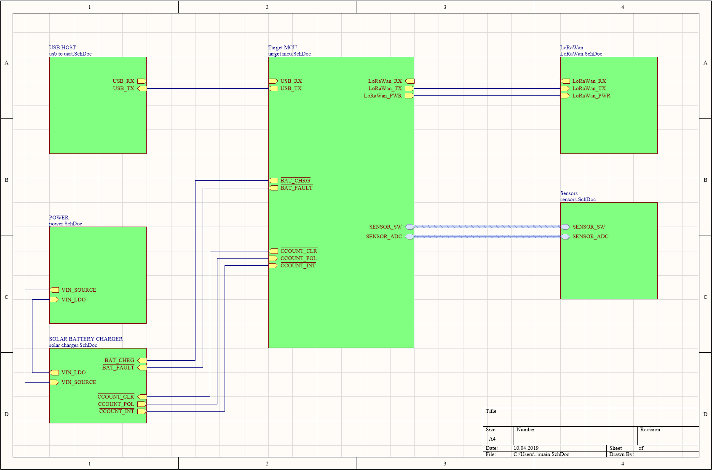
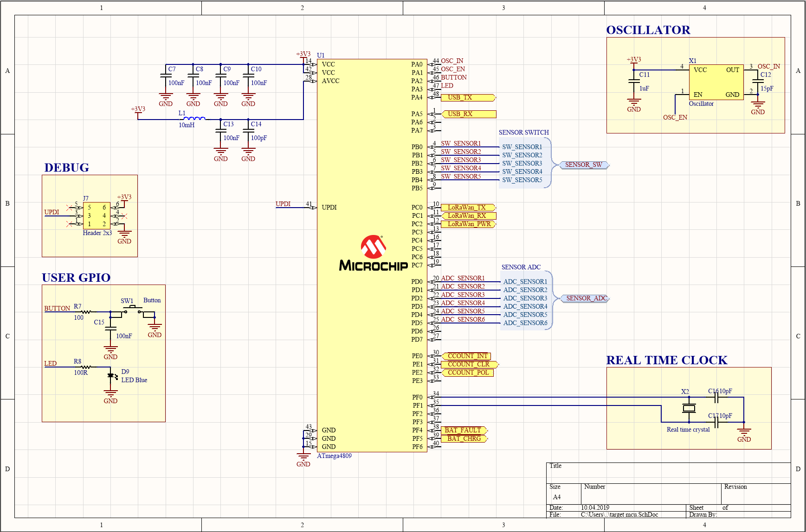
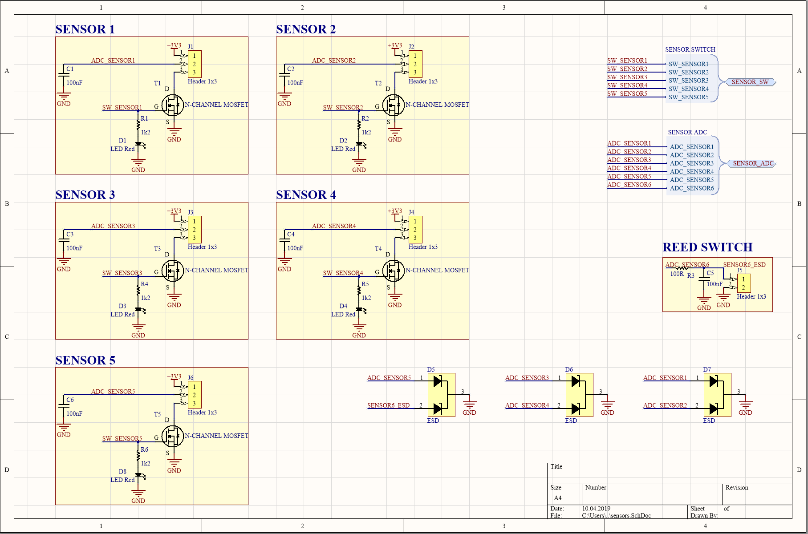
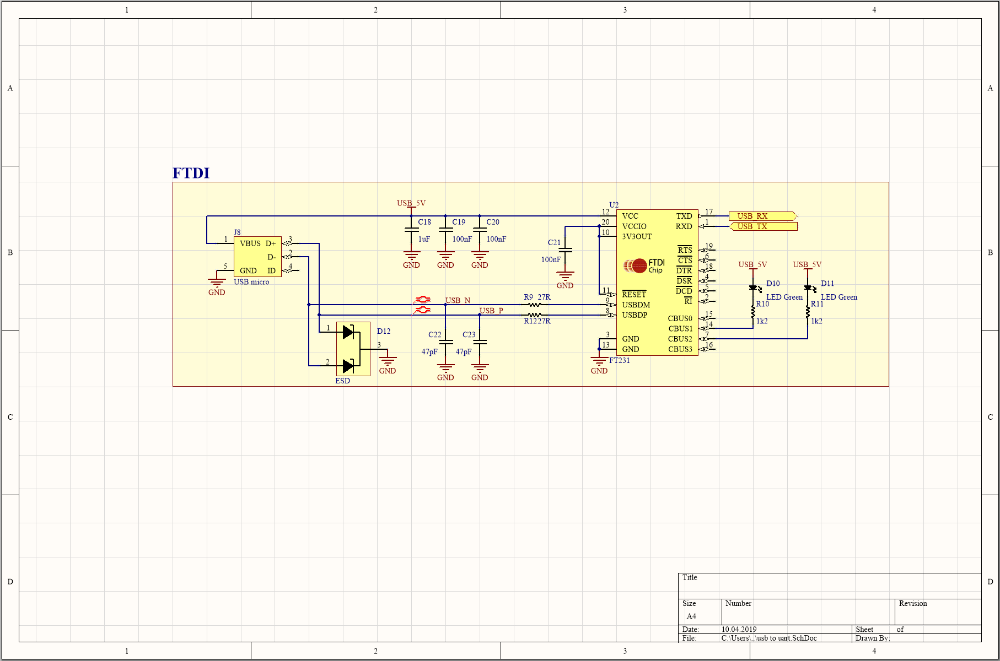
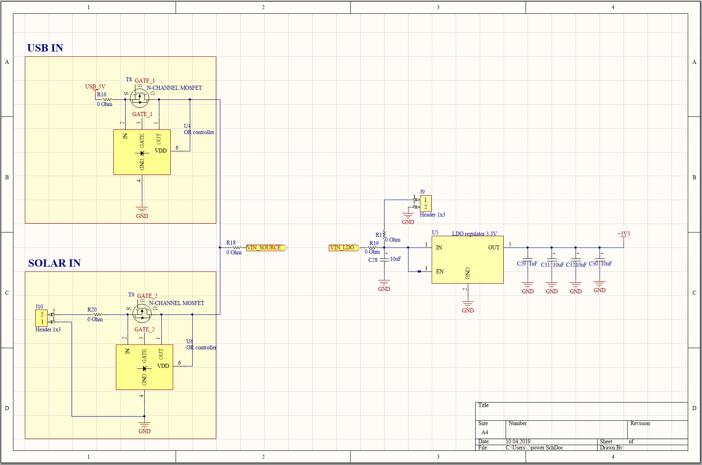
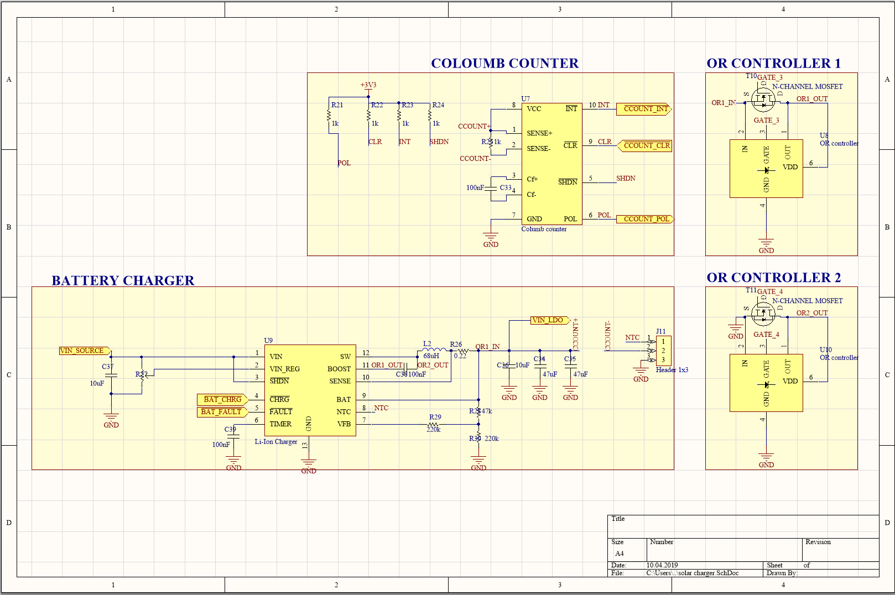
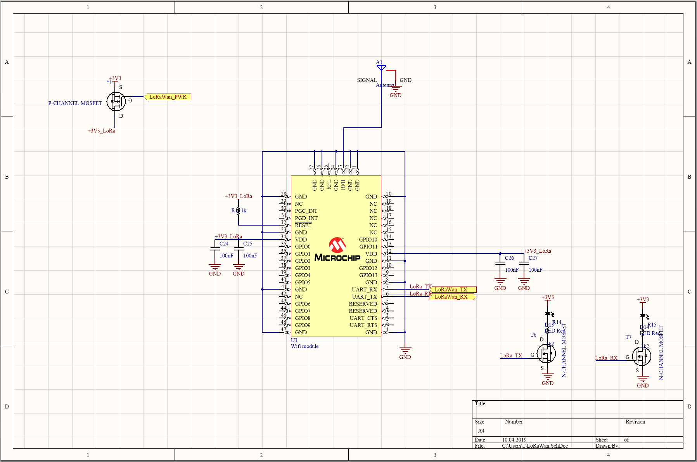

# Smartwater

This repository contains project files for the PCB design of an IoT sensor node responsible for datalogging of pollution parameters in rivers. 

The design was done in Altium 19 in collaboration with [Bjørn Brodtkorb](https://github.com/bjornbrodtkorb) as part of the subject [TTT4270](https://www.ntnu.no/studier/emner/TTT4270/2018) at NTNU.

---

## Features

* Utilizes the state-of-the art Microchip [ATmega4809](https://www.microchip.com/wwwproducts/en/ATMEGA4809) MCU.
* Transmits sensor data over LoRaWAN using the Microchip [RN2483A](https://www.microchip.com/wwwproducts/en/RN2483) module.
* Can log data from five different sensors (analog) simultaneously.
* The sensors can be powered down using NMOS-transistors to prevent them from drawing current when not in use.
* Intrusion detection system: Using a reed sensor, the system can be configured to send an alert when the casing has been opened.
* Low power mode: MCU can enter deep sleep, and the LoRaWAN chip can be powered down by a PMOS transistor connected to VCC.
* Battery powered by single cell Li-ion batteries.
* Batteries may be charged via the USB port.
* Can be connected to a solar cell, which will charge the batteries when sufficient sun intensity.
* Coloumb counter keeps track on how much capacity there is left on the batteries.
* Works with 800MHz LoRaWAN.

## Screenshots

### 3D model

**Figure 1:** *3D-view of the PCB. Dimensions: 8cm☓5cm.*

### 2D model

**Figure 2:** *2D-view of the PCB. Ground planes are hidden in order to better show all traces.*

### Block diagram

**Figure 3:** *Block diagram of the system.*

**Figure 4:** *Schematic diagram of the target MCU block.*

### Schematics

**Figure 5:** *Schematic diagram for the sensors block.*

**Figure 6:** *Schematic diagram of the USB-to-UART block.*

**Figure 7:** *Schematic diagram of the power block.*

**Figure 8:** *Schematic diagram of the solar charger block. The or controllers are used as a replacement for schottky diodes in order to get a higher output voltage.*

**Figure 2:** *Schematic diagram of the LoRaWAN block.*

## Known issues

* The LDO regulator has wrong footprint. This is not a critical issue, because by soldering it on carefully it will work well (the footprint was fortunately too large).
* The USB-to-FTDI block is missing a ferrite bead between VBUS and the capacitors. It should be noted that it will work fine without it.
* The stitching underneath the RN2483A LoRaWAN module should have been done by using tented vias. This was not done because untented vias looked cool. However, the module has test pads underneath which gets shorted to ground with this design. Consider using an isolating tape underneath the module or change the stitching to tented vias to fix this issue.
* Many pads have traces exiting not directly out in the right direction. This may lead to soldering issues because of wrong thermal conductivity properties. Ingulf Helland informed us about this in a design review after the PCB had been manufactured.